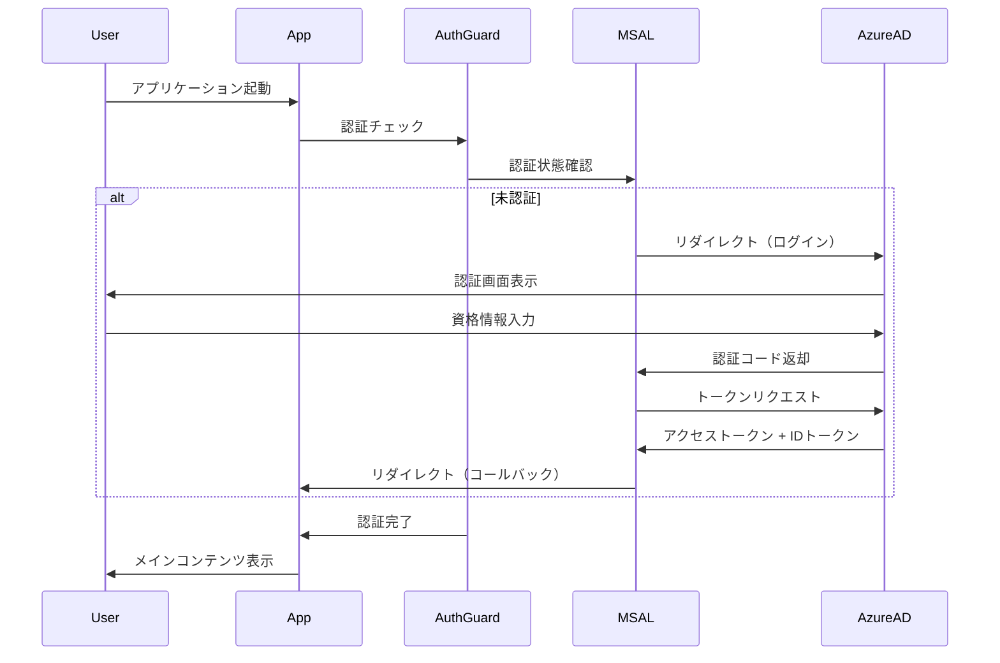
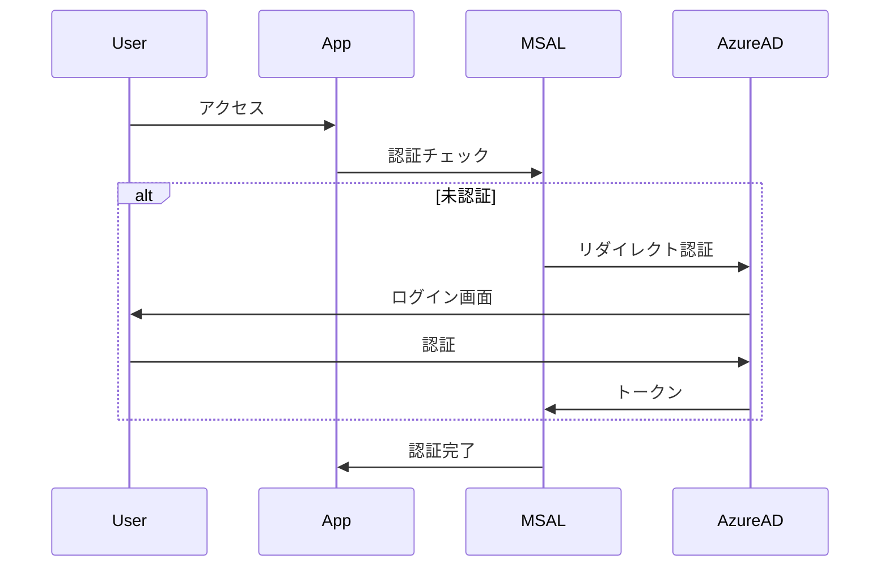
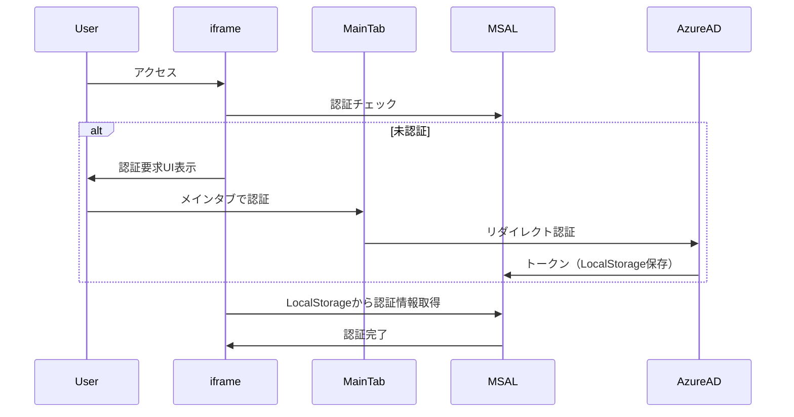

# 認証システム実装ガイド

このドキュメントでは、Azure MSAL Browserを使用したSSO認証の実装詳細を説明します。

## 認証アーキテクチャ

### 使用技術

- **MSAL Browser 3.x**: Microsoft Authentication Library for JavaScript
- **Azure AD (Microsoft Entra ID)**: エンタープライズ認証基盤
- **React 19.2**: UIフレームワーク

### 認証フロー



## ファイル構成

### 主要ファイル

```
src/
├── config/
│   └── authConfig.ts          # MSAL設定
├── lib/
│   └── msalInstance.ts        # MSALインスタンス作成
├── components/
│   └── auth/
│       └── AuthGuard.tsx      # 認証ガードコンポーネント
├── hooks/
│   └── useAuth.ts             # 認証カスタムフック
└── app/
    └── provider.tsx           # MsalProvider統合
```

## 実装詳細

### 1. MSAL設定（authConfig.ts）

```typescript
import { Configuration, PopupRequest } from '@azure/msal-browser';

export const msalConfig: Configuration = {
  auth: {
    clientId: import.meta.env.VITE_CLIENT_ID,
    authority: import.meta.env.VITE_AUTHORITY,
    redirectUri: import.meta.env.VITE_REDIRECT_URI,
    navigateToLoginRequestUrl: false,
  },
  cache: {
    cacheLocation: 'sessionStorage', // または 'localStorage'
    storeAuthStateInCookie: false,
  },
  system: {
    allowNativeBroker: false,
    loggerOptions: {
      loggerCallback: (level, message, containsPii) => {
        if (containsPii) return;
        console.log(message);
      },
      piiLoggingEnabled: false,
      logLevel: import.meta.env.DEV ? 3 : 1, // Dev: Verbose, Prod: Error
    },
  },
};

export const loginRequest: PopupRequest = {
  scopes: import.meta.env.VITE_SCOPES?.split(',') || ['User.Read'],
};
```

**設定のポイント**:

- `cacheLocation`: トークンの保存場所
  - `sessionStorage`: タブを閉じると削除（推奨）
  - `localStorage`: ブラウザを閉じても保持
- `navigateToLoginRequestUrl`: ログイン後の遷移制御
- `logLevel`: 開発環境ではVerbose、本番環境ではErrorのみ

### 2. MSALインスタンス（msalInstance.ts）

```typescript
import { PublicClientApplication } from '@azure/msal-browser';
import { msalConfig } from '../config/authConfig';

export const msalInstance = new PublicClientApplication(msalConfig);

// 初期化
msalInstance.initialize().then(() => {
  // アカウントの復元
  const accounts = msalInstance.getAllAccounts();
  if (accounts.length > 0) {
    msalInstance.setActiveAccount(accounts[0]);
  }
});
```

### 3. 認証ガード（AuthGuard.tsx）

```typescript
import { useMsal } from '@azure/msal-react';
import { useEffect, useState } from 'react';
import { InteractionStatus } from '@azure/msal-browser';
import { loginRequest } from '../../config/authConfig';

export const AuthGuard = ({ children }: { children: React.ReactNode }) => {
  const { instance, accounts, inProgress } = useMsal();
  const [isAuthenticated, setIsAuthenticated] = useState(false);

  useEffect(() => {
    const checkAuth = async () => {
      // 認証処理中は待機
      if (inProgress !== InteractionStatus.None) {
        return;
      }

      // 既に認証済み
      if (accounts.length > 0) {
        setIsAuthenticated(true);
        return;
      }

      // 未認証 - ログインリダイレクト
      try {
        await instance.loginRedirect(loginRequest);
      } catch (error) {
        console.error('Authentication failed:', error);
      }
    };

    checkAuth();
  }, [instance, accounts, inProgress]);

  // 認証中は何も表示しない
  if (!isAuthenticated) {
    return null;
  }

  return <>{children}</>;
};
```

**実装のポイント**:

- `inProgress`: 認証処理の状態を確認（ループ防止）
- `loginRedirect`: ポップアップではなくリダイレクト方式を使用
- 認証中は子コンポーネントを表示しない

### 4. 認証フック（useAuth.ts）

```typescript
import { useMsal } from '@azure/msal-react';
import { useCallback } from 'react';

export const useAuth = () => {
  const { instance, accounts } = useMsal();
  const account = accounts[0];

  const getAccessToken = useCallback(
    async (scopes: string[]) => {
      try {
        const response = await instance.acquireTokenSilent({
          scopes,
          account,
        });
        return response.accessToken;
      } catch (error) {
        console.error('Token acquisition failed:', error);
        // サイレント取得失敗時はリダイレクト
        await instance.acquireTokenRedirect({ scopes, account });
        return null;
      }
    },
    [instance, account]
  );

  const logout = useCallback(() => {
    instance.logoutRedirect({
      account,
    });
  }, [instance, account]);

  return {
    userName: account?.name || '',
    userEmail: account?.username || '',
    getAccessToken,
    logout,
  };
};
```

**実装のポイント**:

- `acquireTokenSilent`: トークンを自動で取得（キャッシュまたはリフレッシュ）
- サイレント取得失敗時は `acquireTokenRedirect` にフォールバック
- `logout`: ログアウト後にAzure ADのログアウト画面にリダイレクト

### 5. プロバイダー統合（provider.tsx）

```typescript
import { MsalProvider } from '@azure/msal-react';
import { msalInstance } from '../lib/msalInstance';
import { AuthGuard } from '../components/auth/AuthGuard';

export const AppProvider = ({ children }: { children: React.ReactNode }) => {
  return (
    <MsalProvider instance={msalInstance}>
      <AuthGuard>
        {children}
      </AuthGuard>
    </MsalProvider>
  );
};
```

## トークン管理

### トークンの種類

1. **IDトークン**: ユーザー情報（名前、メールアドレス等）
2. **アクセストークン**: APIリクエストに使用（有効期限: 1時間）
3. **リフレッシュトークン**: アクセストークンの更新（有効期限: 90日）

### トークンの自動更新

MSAL Browserは、トークンの有効期限が切れる前に自動的にリフレッシュします。

```typescript
// 自動リフレッシュのしきい値設定（デフォルト: 5分前）
export const msalConfig: Configuration = {
  auth: { /* ... */ },
  cache: { /* ... */ },
  system: {
    tokenRenewalOffsetSeconds: 300, // 5分前にリフレッシュ
  },
};
```

### トークンの取得例

```typescript
import { useAuth } from '../hooks/useAuth';

function MyComponent() {
  const { getAccessToken } = useAuth();

  const callApi = async () => {
    // Microsoft Graph APIのトークンを取得
    const token = await getAccessToken(['https://graph.microsoft.com/User.Read']);
    
    if (!token) return;

    // APIリクエスト
    const response = await fetch('https://graph.microsoft.com/v1.0/me', {
      headers: {
        Authorization: `Bearer ${token}`,
      },
    });

    const data = await response.json();
    console.log(data);
  };

  return <button onClick={callApi}>ユーザー情報取得</button>;
}
```

## セキュリティベストプラクティス

### 1. スコープの最小化

必要最小限のスコープのみを要求してください。

```typescript
// ❌ 過剰な権限
const scopes = ['User.ReadWrite.All', 'Mail.ReadWrite', 'Files.ReadWrite.All'];

// ✅ 必要最小限
const scopes = ['User.Read'];
```

### 2. トークンの安全な保管

- **推奨**: `sessionStorage`（タブを閉じると削除）
- **非推奨**: `localStorage`（永続化によるリスク増加）

### 3. HTTPS必須

本番環境では必ずHTTPSを使用してください。

```typescript
// Azure ADアプリの登録でHTTPSのリダイレクトURIを設定
redirectUri: 'https://your-domain.com',
```

### 4. CSPヘッダーの設定

Content Security Policyを設定してXSS攻撃を防ぎます。

```html
<!-- index.html -->
<meta http-equiv="Content-Security-Policy" 
      content="default-src 'self'; 
               script-src 'self' 'unsafe-inline'; 
               connect-src 'self' https://login.microsoftonline.com https://graph.microsoft.com;">
```

## トラブルシューティング

### ログインループ

**症状**: ログイン後に再度ログイン画面に戻る

**原因**: `navigateToLoginRequestUrl`の設定不備

**解決策**:
```typescript
export const msalConfig: Configuration = {
  auth: {
    navigateToLoginRequestUrl: false, // これを追加
  },
};
```

### トークン取得エラー

**症状**: `acquireTokenSilent`で「consent_required」エラー

**原因**: ユーザーがスコープに同意していない

**解決策**:
```typescript
try {
  const response = await instance.acquireTokenSilent({ scopes, account });
  return response.accessToken;
} catch (error) {
  if (error.errorCode === 'consent_required') {
    // 同意画面を表示
    await instance.acquireTokenRedirect({ scopes, account });
  }
}
```

### CORS エラー

**症状**: Azure ADへのリクエストでCORSエラー

**原因**: リダイレクトURIが正しく設定されていない

**解決策**: Azure Portalでリダイレクト URIを「シングルページアプリケーション (SPA)」として登録

## iframe環境での認証対応

### 概要

本アプリケーションは、iframe環境（Microsoft Teams、SharePoint等）での使用を想定しており、特別な認証対応を実装しています。

### 主要機能

1. **iframe環境の自動検知**
2. **LocalStorage共有による認証状態同期** 
3. **別タブでのユーザー選択ダイアログ回避**
4. **iframe専用のUI制御**

### 実装詳細

#### 1. 環境検知とキャッシュ設定

```typescript
// authConfig.ts - LocalStorage使用でタブ間共有
export const msalConfig: Configuration = {
  cache: {
    cacheLocation: "localStorage", // sessionStorage → localStorage
  },
};

// AuthGuard.tsx - iframe環境の判定
const urlParams = new URLSearchParams(window.location.search);
const isMainframe = urlParams.get('mainframe') === 'true';
const isInIframe = (window.self !== window.top) && !isMainframe;
```

**重要**: `sessionStorage` から `localStorage` に変更することで、同一オリジン内でのタブ間認証情報共有が可能になります。

#### 2. iframe専用認証フロー

```typescript
// AuthGuard.tsx - 環境別認証処理
if (isInIframe) {
  // iframe内では認証要求UIを表示
  console.log('iframe環境：メインフレームでの認証を促します');
  setShowManualAuth(true);
} else {
  // 通常環境ではリダイレクト認証
  instance.loginRedirect(loginRequest);
}
```

**制限事項**: MSALライブラリの仕様により、iframe内では `loginRedirect` を使用できません。

#### 3. iframe専用UI

認証が必要な場合、以下のユーザーフレンドリーなUIを表示：

```jsx
// AuthGuard.tsx - iframe認証UI
<div style={{ /* 認証要求UI */ }}>
  <h3>認証が必要です</h3>
  <p>iframe内では認証を実行できません。</p>
  <button onClick={handleOpenMainFrame}>
    🚀 メインウィンドウで認証する
  </button>
</div>
```

#### 4. 親ウィンドウとの連携

```typescript
// AuthGuard.tsx - 親ウィンドウとの通信
const handleOpenMainFrame = () => {
  // 新しいタブでメインウィンドウを開く
  window.open(window.location.origin, '_blank');
};
```

#### 5. UI制御の最適化

```typescript
// TopBar.tsx - iframe環境でのログアウトメニュー非表示
const isInIframe = (window.self !== window.top) && !isMainframe;

{/* 条件付きレンダリング */}
{!isInIframe && <Option value="logout">ログアウト</Option>}
```

### 認証フローパターン

#### パターンA: 通常環境


#### パターンB: iframe環境


### テスト環境

iframe認証機能のテストには専用のテストページを使用します：

```bash
# プレビューサーバー起動
npm run preview

# テストページアクセス
http://localhost:3000/iframe-test.html
```

**テストシナリオ**:
1. サイドバー（iframe）で認証UI確認
2. 「メインウィンドウで認証する」をクリック
3. 新しいタブで認証完了
4. 元のページに戻ってiframe再読み込み
5. 認証状態の共有確認

### トラブルシューティング

#### 認証情報が共有されない

**原因**: オリジンの違い
- `file://` プロトコルと `http://` プロトコル間では LocalStorage が共有されない

**解決策**: 同一オリジン（`http://localhost:3000`）でテスト実行

#### iframe内でリダイレクトエラー

**症状**: `redirect_in_iframe` エラー
**原因**: MSALの iframe内リダイレクト制限
**解決策**: 既実装の iframe 専用認証フローを使用

#### ログアウトボタンが表示される

**原因**: iframe判定ロジックの不具合
**解決策**: URLパラメータまたは環境変数での制御確認

## 参考リソース

- [MSAL.js 公式ドキュメント](https://learn.microsoft.com/ja-jp/azure/active-directory/develop/msal-overview)
- [Azure AD認証フロー](https://learn.microsoft.com/ja-jp/azure/active-directory/develop/v2-oauth2-auth-code-flow)
- [Microsoft Graph API](https://learn.microsoft.com/ja-jp/graph/overview)
- [MSAL iframe制限について](https://learn.microsoft.com/ja-jp/azure/active-directory/develop/msal-js-avoid-page-reloads)
